 

I'm Iliya, online as **august**. I build software I want to exist: mostly Windows tools that sit close to the system, automate work I'd otherwise do by hand, or show what a machine is really doing. Most of it runs locally.

 

## Projects

| Project | What it does |
|:--|:--|
| **[MineHunter](https://github.com/ilyasaffonovv-commits/MineHunter)** C# · WPF · Windows | Finds hidden cryptominers, their watchdogs and the persistence that brings them back after a reboot. Every verdict lists its evidence, removal goes through a reversible quarantine, and success is reported only if a rescan confirms it. Fully local, no telemetry. |
| **[AUGUST](https://github.com/ilyasaffonovv-commits/august)** Local AI agent · [site](https://ilyasaffonovv-commits.github.io/august/) | An agent that runs on my own machine: local Qwen model, persistent memory, multi-step task planning, and a check on every result before a task counts as done. This repository is its public site (in Russian). |
| **[TwistFrame Publisher](https://github.com/ilyasaffonovv-commits/twistframe-publisher)** Automation | Publishes short-form video to YouTube, Instagram and TikTok through their official APIs: checks the file, writes the metadata, uploads, confirms. Not distributed. This repository is its public site with the terms and privacy policy. |

Found a false positive in MineHunter? Open an issue there, it's treated as a bug.

 

## Focus

- **Windows tools:** small native programs, no installer, no third-party packages.
- **Automation:** turning a chain of repeated steps into one command that checks its own result.
- **Security research:** how miners, watchdogs and other persistence work on Windows, and how to detect them without flagging normal software.
- **Creative software:** tools around short-form video and media production.
- **Local AI tools:** models and agents that run on my own hardware.

 

## How I build

- **Check the result, not the action.** A cleanup that ran is not a cleanup that worked. MineHunter rescans before it says done, AUGUST verifies a task before it counts it.
- **Keep destructive steps reversible.** Quarantine before delete, restore from a list.
- **Local by default.** No accounts, no telemetry, nothing leaves the machine unless it has to.

 

## Now

- **MineHunter:** detection rules and false-positive calibration. Rule packs ship separately from the exe and are signature-verified.
- **AUGUST:** working with the computer and browser, and long tasks that continue after errors.
- **More Windows tools.** Not public yet.

 

`C#` `.NET` `WPF` `PowerShell` `Win32 / WMI / Registry` `HTML · CSS · JS` `Bash`
